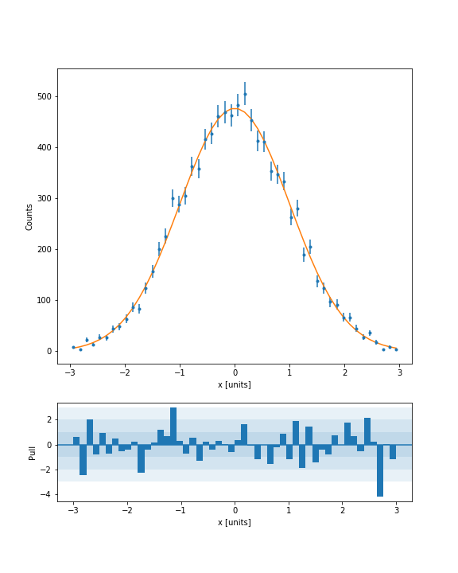

## Installation

### PyPI

You can set up a development environment using PyPI.

```bash
$ python3 -m venv .env            # Make a new environment in ./.env/
$ source .env/bin/activate        # Use the new environment
(.env)$ pip install -r requirements.txt # Install the package requirements
(.env)$ pip install -e .                # Install this package in editable mode
(.env)$ python -m ipykernel install --user --name nino-hist    # Install nino-hist jupyter kernel
```

You'll need to run `$ source .env/bin/activate` if you open a new shell. You can use `(.env)$ deactivate` to turn off the environment in your current shell.

The final line installs the package into your environment so that you can run the code from anywhere as long as the environment is activated.

If, while working on the project, you need any other python packages, such as for plotting, add them to the "requirements.txt" or in "setup.py" and re-install requirements `(.env)$ pip install -r requirements.txt`.

Just `$ rm -r .env` if you want to remove this enviroment, and `$ jupyter kernelspec nino-hist` to remove kernel correspondingly.

### Conda

You can also set up a development environment using Conda. This is the recommended way, because you can import some large binaries unavailable on PyPI, such as root, and test the latest version.

```bash
$ conda env create -f environment.yml -n nino-hist
$ conda activate nino-hist
(nino-hist)$ python3 -m ipykernel install --name nino-hist
```

You'll need to re-activate `$ conda activate nino-hist` if you open a new shell. You can use `(nino-hist)$ deactivate` to turn off the environment in your current shell.

If, while working on the project, you need any other python packages, such as for plotting, add them to the "requirements.txt" or in "environment.yml", deactivating the environment `(nino-hist)$ conda deactivate` and updating it `$ conda env update -f environment.yml -n nino-hist`.

If your are using a Python3 virtul enviroment at the same time, you are recommended to use a different Jupyter kernel name to distinguish them `(nino-hist)$ python3 -m ipykernel install --name nino-hist-conda`.

Use `$ conda env remove -n nino-hist` to remove the conda environment if you do not need this anymore. And do not forget`$ jupyter kernelspec remove nino-hist` to remove kernel correspondingly (if you are using a different kernel name, `$ jupyter kernelspec list` to see your kernels).

## Code

The library is in `/src/hist`. You will be editing it to expand the histogram features, or plotting features, or both. Select one of the below tasks (or do both if you really want to, but only one required for full consideration).

### Features to add (Project 1)

For this project, you'll want to expand NamedHist to support named-axis histograms. The idea is this (and is [taken](https://github.com/CoffeaTeam/coffea/tree/master/coffea/hist) directly from the [Coffea](https://github.com/CoffeaTeam/coffea) project): All axes have a *required* name. These names are used (and generally required) throughout the interface. For example:

```python
# Data generation

import numpy as np

# Random numbers from -1 to 1
x,y = np.random.random_sample([2, 1_000_000])*2 - 1

# Only hits inside radius 1 are "valid"
valid = (x**2 + y**2) < 1
```

```python
# Pure boost-histogram
import boost_histogram as bh

h = bh.Histogram(
    bh.axis.Regular(10, -1, 1, metadata={'name':'x'}),
    bh.axis.Regular(10, -1, 1, metadata={'name':'y'}),
    bh.axis.Integer(0, 2, underflow=False, overflow=False, metadata={'name':'valid'}),
)

h.fill(x, y, valid)

valid_only = h[:, :, bh.loc(True)] # Passing True directly happens to work here as well
valid_only = h[{2:bh.loc(True)}]   # Alternate way to do the same thing ### BROKEN in 0.6.2

valid_and_invalid = h[:, :, ::bh.sum]                 # All (valid and invalid)
valid_and_invalid = h[{2:slice(None, None, bh.sum)}]   # Alternate way to do the same thing
```

> Note: The metadata here is a bit more complex than you might normally make it just to illustrate how it will be internally stored in Hist.

```python
# Hypothetical Hist

from hist import NamedHist, axis

h = NamedHist(
    axis.Regular(10, -1, 1, name="x"),
    axis.Regular(10, -1, 1, name="y"),
    axis.bool(name="valid"),
)

h.fill(x=x, y=y, valid=valid)

valid_and_invalid = h[{"valid": slice(None, None, bh.sum)}]
```

So, for this task, you should make sure `NamedHist` a) requires name to be set on any axis, b) requires keyword fills by name, and c) allows (or requires) `__getitem__` access by named dict key instead of axis number. You should also implement one shortcut axis type, `bool`, which is just a shortcut for making an Integer axis with underflow and overflow turned off, and with only two bins starting at zero. I've started this project for you by setting up "name" for Regular axis, feel free to look at that to get started.


### Plots to add (Project 2)

Histograms in HEP often use pull plots ([like this one](https://cds.cern.ch/record/1969801/files/Figure2a.png)). Let's play with a basic histogram plot method that adds a pull plot method to a hist object.


Let's call the method `pull_plot` (eventually, we might call it `plot.pull`, to be like Pandas), but this is fine for now. Let's propose a possible interface:

```python
from hist import NamedHist, axis

data = np.random.normal(size=10_000)
h = Hist(
    axis.Regular(50, -3, 3, title="data [units]"),
)
h.fill(data)

def pdf(x):
    return 1/np.sqrt(2*np.pi) * np.exp(-.5*x**2)

ax1, ax2 = h.pull_plot(pdf)
```

This involves: a) adding `title` as an axis option (`name` is already added for you, just expand on that), b) adding the `pull_plot` method, and c) trying to make the final output look as nice as you can. Here is my recommended interface:

```python
    def pull_plot(self, callable, *, ax=None, pull_ax=None): # add more formatting options here as needed!
        # If ax and pull_ax are none, make a new figure and add the two axes with the proper ratio between them.
        # Otherwise, just use ax and pull_ax.
        ...

        # Compute PDF values
        values = pdf(*self.axes.centers)*self.sum()*self.axes[0].widths
        yerr = np.sqrt(self.view())

        # Compute Pulls
        pulls = (self.view() - values) / yerr

        ...
        return ax, pull_ax
```

Here is an example of a possible output:



**Your output does not need to exactly match this styling!** It is just a
general example to get you started. I'm using three Rectangle Patches with
alpha to indicate pulls of +/- 3 sigma (with a `blended_transform_factory`
copied from the matplotlib documentation to define a width in axes space and a
height in data space), and I'm using a bar plot for pulls and a errorbar (with
dots instead of bars) for the main plot, and a 3:1 ratio between the plots.

> For the purpose of this exercise, we are just focusing on the plotting and
> not really on the calculation of the pull. Just a simple function for
> comparison will do for now.

You did not come up with a perfect API that covers every possible use case (I would assume). Please write down a couple of sentences about potential improvements to make it more general.

## Notebooks

Write one Jupyter notebook showing off your new feature(s) or new plot. Unlike most Jupyter notebooks, it is okay to save the output in the notebook so that it can be seen quickly.

## Tests

This is mostly there to verify you understand basic testing procedures. Testing is already set up, all you have to do is **add tests for the features you add**. I am lightly recommending native pytest-style testing, but if you have a preference for a different style, go for it as long as pytest can still run it.

If you focus on plotting, at least add one non-plotting feature + test, but the plots themselves are notoriously hard to test, so don't worry too much about that unless you have a good idea for a way to test a plot.

## Formatting

I like using [pre-commit](https://pre-commit.com) to handle style. The styling is checked in CI; you don't have to make this check pass if you don't want to (though adding and enabling pre-commit is easy).

